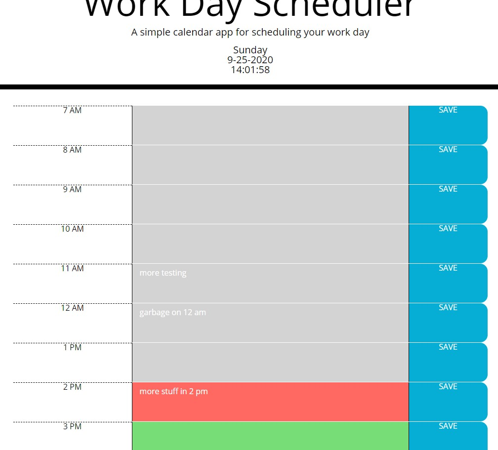

# Work Day Scheduler
* * *
## Installation
In your terminal enter:
git clone https://github.com/detanracnier/BC_10-31_Work_Day_Scheduler.git
or if you have set up ssh:
git clone git@github.com:detanracnier/BC_10-31_Work_Day_Scheduler.git

## Description
A simple calendar application that allows a user to save events for each hour of the day. Users can modify their buisness hours and how time is displayed in their preferences.

## Deployed sight
[here](https://detanracnier.github.io/BC_10-31_Work_Day_Scheduler/)

